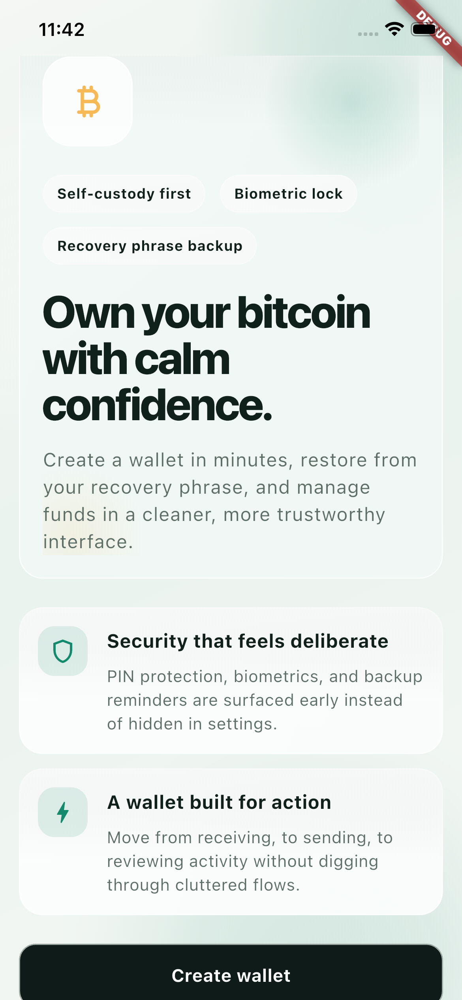
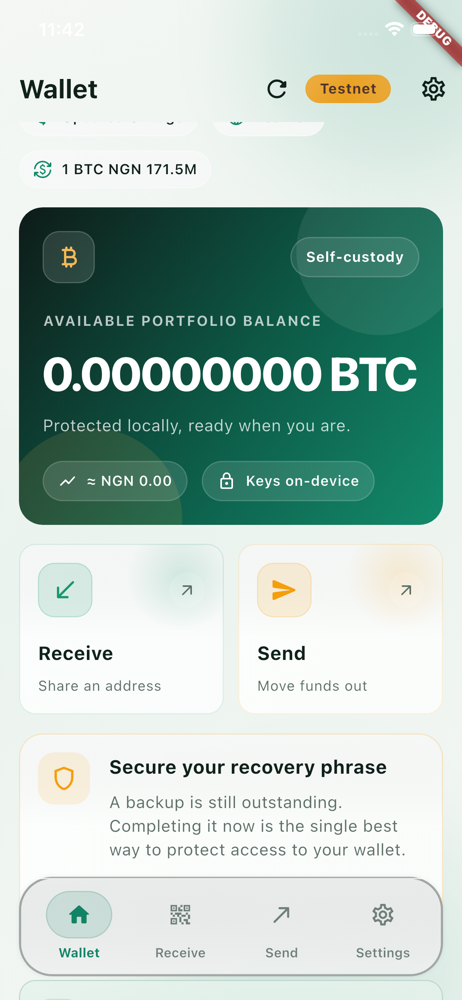
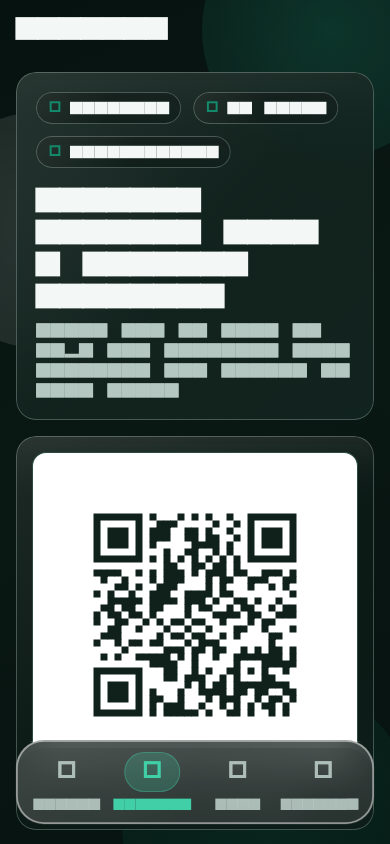
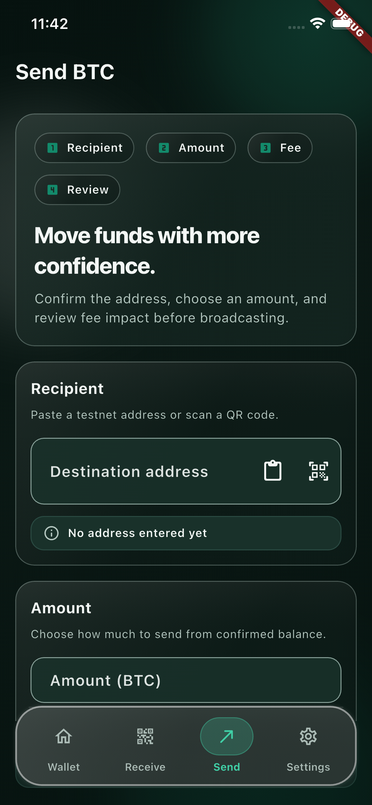
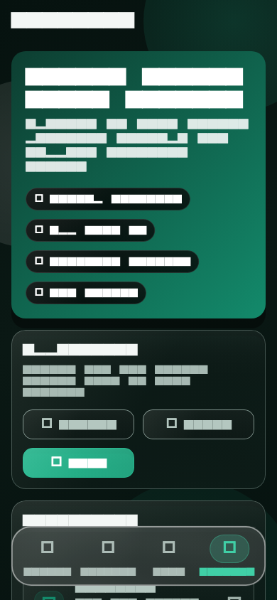
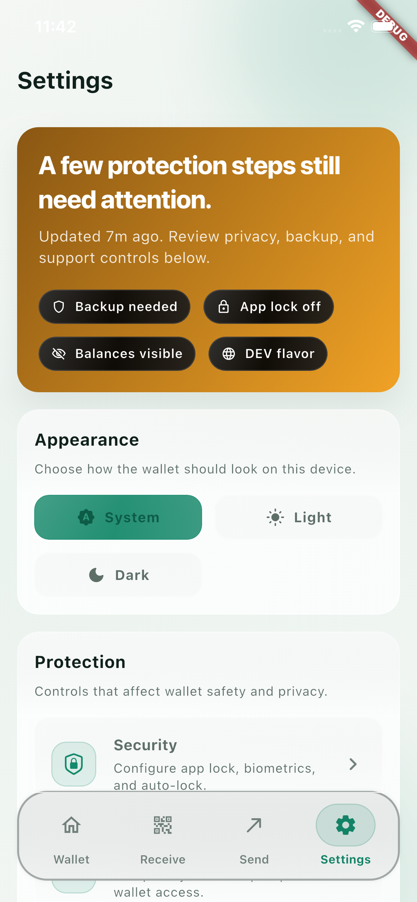
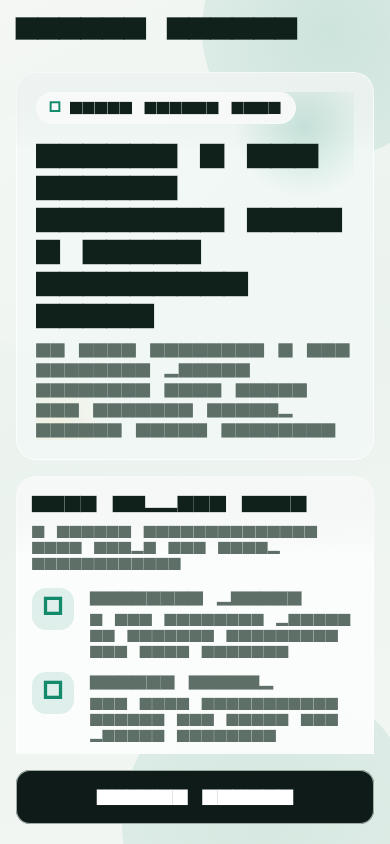
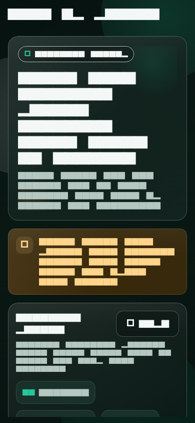
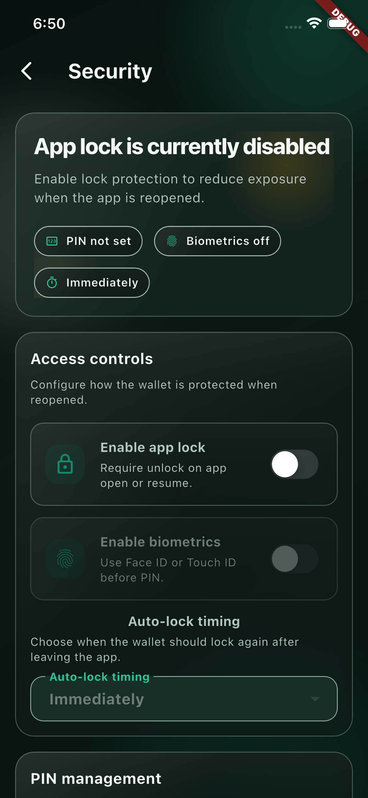

# Root Wallet

Root Wallet is a self-custody Bitcoin wallet focused on public testnet flows, clean architecture, and a polished Flutter user experience.

It is built for real wallet behavior on testnet:
- create and restore wallet flows
- recovery phrase backup and confirmation
- receive address + QR
- send -> review -> broadcast
- transaction history and details
- app lock, PIN, biometrics, and recovery re-auth
- liquid-glass light and dark themes

## Product Snapshot

Root Wallet is intentionally opinionated:
- self-custody first
- public Bitcoin testnet by default
- Riverpod for app orchestration
- feature-first clean architecture
- no SDK or network calls inside widgets
- UI regression coverage for the main app shell and onboarding/security flows

## Screenshot Gallery

The README screenshot assets live in [`docs/screenshots`](docs/screenshots/README.md). The current gallery is sourced from the app's verified golden baselines so the visuals stay aligned with the shipped UI.

<table>
  <tr>
    <td align="center">
      
      <br />
      <strong>Welcome</strong>
      <br />
      First-run onboarding
    </td>
    <td align="center">
      
      <br />
      <strong>Wallet Home</strong>
      <br />
      Portfolio overview and activity
    </td>
    <td align="center">
      
      <br />
      <strong>Receive</strong>
      <br />
      Testnet address and QR handoff
    </td>
  </tr>
  <tr>
    <td align="center">
      
      <br />
      <strong>Send</strong>
      <br />
      Amount, fee, and review flow
    </td>
    <td align="center">
      
      <br />
      <strong>Settings</strong>
      <br />
      App controls and wallet operations
    </td>
    <td align="center">
      
      <br />
      <strong>Security</strong>
      <br />
      App lock, biometrics, and re-auth
    </td>
  </tr>
  <tr>
    <td align="center">
      
      <br />
      <strong>Create Wallet</strong>
      <br />
      First wallet setup
    </td>
    <td align="center">
      
      <br />
      <strong>Backup Phrase</strong>
      <br />
      Recovery phrase protection
    </td>
    <td align="center">
      
      <br />
      <strong>App Lock</strong>
      <br />
      PIN and biometric gate
    </td>
  </tr>
</table>

## Documentation Map

- Project architecture: [docs/architecture.md](docs/architecture.md)
- Development workflow: [docs/development_guide.md](docs/development_guide.md)
- Testing and QA: [docs/testing_and_qa.md](docs/testing_and_qa.md)
- Privacy and security notes: [docs/privacy_security.md](docs/privacy_security.md)
- Mobile permission notes: [docs/mobile_permissions.md](docs/mobile_permissions.md)
- Troubleshooting: [docs/troubleshooting.md](docs/troubleshooting.md)
- Device sign-off checklist: [docs/device_qa_checklist.md](docs/device_qa_checklist.md)
- Release checklist: [docs/release_checklist.md](docs/release_checklist.md)
- Release notes: [docs/release_notes.md](docs/release_notes.md)
- Changelog: [CHANGELOG.md](CHANGELOG.md)

## Feature Overview

### Wallet
- Create or restore a Bitcoin testnet wallet
- Sync balance and recent activity
- Persist wallet data and cache wallet snapshots
- View transaction details and open explorer links

### Receive
- Generate a testnet receive address
- Display QR code with `qr_flutter`
- Copy raw address or `bitcoin:` URI
- Native share integration via `share_plus`

### Send
- Manual paste or QR scan via `mobile_scanner`
- Parse raw addresses and `bitcoin:` URIs
- Fee selection and transfer review
- Broadcast on public testnet

### Security
- PIN hashing and secure storage
- App lock and re-auth
- Optional biometrics via `local_auth`
- Recovery phrase reveal protection
- Android screen capture protection while viewing recovery words

### Diagnostics
- Inspect active Testnet Esplora backend
- Inspect BDK network family and wallet database path
- Inspect cached wallet snapshot age and transaction count
- Copy debug context without exposing recovery words or private keys

## BDK integration

Root Wallet now uses `bdk_dart` directly from GitHub as its wallet engine:

```yaml
bdk_dart:
  git:
    url: https://github.com/bitcoindevkit/bdk-dart.git
    ref: main
```

`bdk_dart` is not published on pub.dev yet. Because it builds native FFI assets, a Rust toolchain with `cargo` is required for local builds. The wallet is configured for Bitcoin testnet only, using Blockstream testnet Esplora (`https://blockstream.info/testnet/api`) and Electrum (`ssl://electrum.blockstream.info:60002`) backends.

Root Wallet currently targets Android and iOS wallet functionality, not Flutter Web. Web is unsupported because `bdk_dart` depends on `dart:ffi` and native assets.

## Architecture at a Glance

The app is organized around feature modules and clean boundaries:

- `lib/app`
  - application shell
  - routing
  - theme
  - global providers
- `lib/core`
  - platform wrappers
  - security
  - shared widgets
  - errors, constants, and utilities
- `lib/features`
  - `wallet`
  - `receive`
  - `send`
  - `settings`
  - `onboarding`
  - `rates`
- `lib/shared`
  - cross-feature widgets, extensions, and models

Detailed structure and boundary rules live in [docs/architecture.md](docs/architecture.md).

## Routes

Key routes currently defined in [routes.dart](lib/app/routing/routes.dart):

- `/`
- `/welcome`
- `/wallet/create`
- `/wallet/backup`
- `/wallet/backup/confirm`
- `/wallet/restore`
- `/wallet/transaction`
- `/receive`
- `/send`
- `/send/review`
- `/send/success`
- `/settings`
- `/settings/security`
- `/settings/diagnostics`
- `/settings/about`

## Toolchain Requirements

Root Wallet currently declares:

```yaml
environment:
  sdk: ^3.10.7
```

That means the local Flutter install must bundle a compatible Dart SDK. If your Flutter installation is older, analysis and tests may fail before the app code even runs.

Recommended local baseline:
- Flutter `3.41.4` from [.fvmrc](.fvmrc), or another Flutter release with Dart `3.10.x` or newer
- Rust toolchain with `cargo` for `bdk_dart` native assets
- native assets enabled in Flutter tooling when required by dependencies

See [docs/troubleshooting.md](docs/troubleshooting.md) for the exact failure modes we have already encountered.

## Core Commands

```bash
flutter pub get
dart run flutter_native_splash:create
flutter analyze
flutter test --exclude-tags golden
flutter run
```

## Visual Regression Workflow

The repo maintains golden coverage for the highest-value UI surfaces:

- Main app shell and top-level tabs:
  - [test/main_shell_golden_test.dart](test/main_shell_golden_test.dart)
- Onboarding and security flows:
  - [test/onboarding_security_golden_test.dart](test/onboarding_security_golden_test.dart)

Run the curated suites:

```bash
flutter test test/main_shell_golden_test.dart
flutter test test/onboarding_security_golden_test.dart
```

Hosted CI excludes `golden` tagged tests because strict pixel baselines can
drift across Flutter patch versions and hosted runner renderers. Run golden
suites locally when visual changes are intentional.

Refresh baselines only when the visual change is intentional:

```bash
flutter test test/main_shell_golden_test.dart --update-goldens
flutter test test/onboarding_security_golden_test.dart --update-goldens
```

If a golden fails:

1. Check `test/failures/`
2. Review whether the visual change is intended
3. Update the baseline only after reviewing the diff

## QA Expectations

Before shipping UI-heavy changes:

1. Run `flutter analyze`
2. Run `flutter test --exclude-tags golden`
3. Run the relevant golden suites if visuals changed
4. Verify light and dark mode
5. Verify at least one compact device profile
6. Run through the device checklist in [docs/device_qa_checklist.md](docs/device_qa_checklist.md)

## Network Assumption

Root Wallet is currently configured around public Bitcoin testnet infrastructure:

- testnet Electrum base: `ssl://electrum.blockstream.info:60002`
- testnet Esplora base: `https://blockstream.info/testnet/api`
- testnet explorer base: `https://mempool.space/testnet`

This app is not configured for mainnet by default.

## Dependency Use

Key production dependencies currently integrated:

- `bdk_dart`
- `flutter_riverpod`
- `qr_flutter`
- `mobile_scanner`
- `url_launcher`
- `shared_preferences`
- `local_auth`
- `flutter_secure_storage`
- `crypto`
- `share_plus`

## Contributing Mindset

This repo prefers:

- clean architecture boundaries over quick shortcuts
- Riverpod state ownership over widget-local business logic
- reusable design system changes over one-off screen patches
- test coverage for critical flows and visual baselines for core UI

If you are changing behavior or visuals, leave the repo easier to reason about than you found it.
