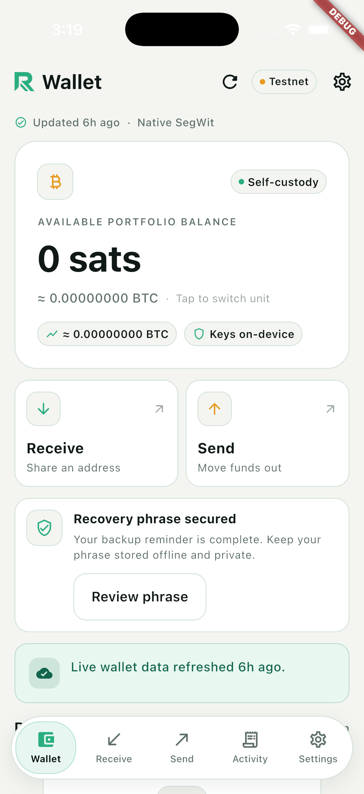
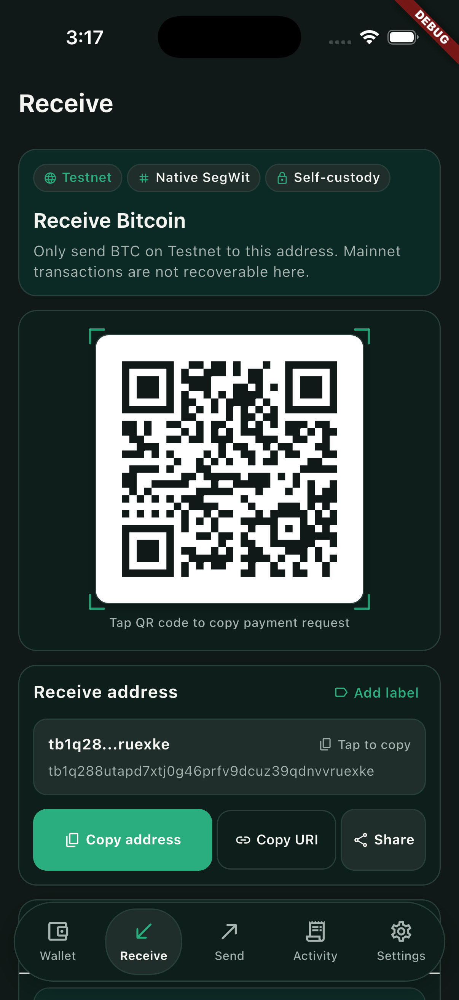
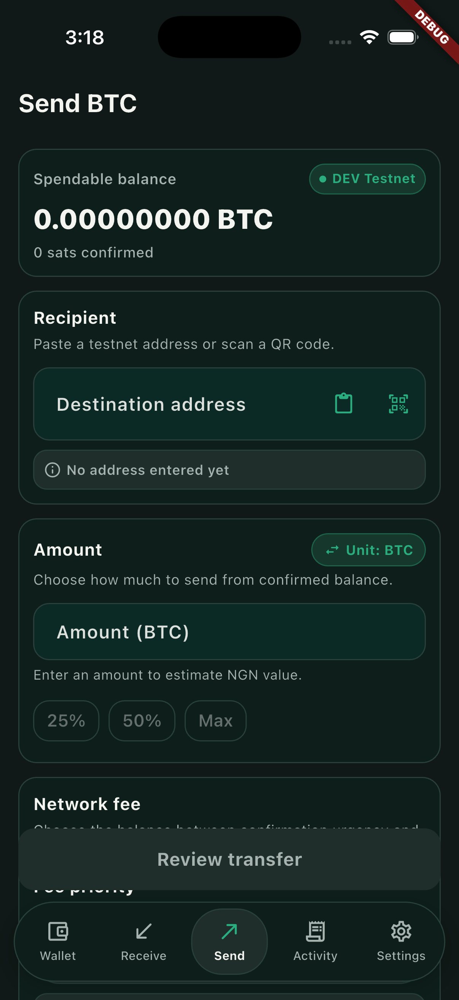
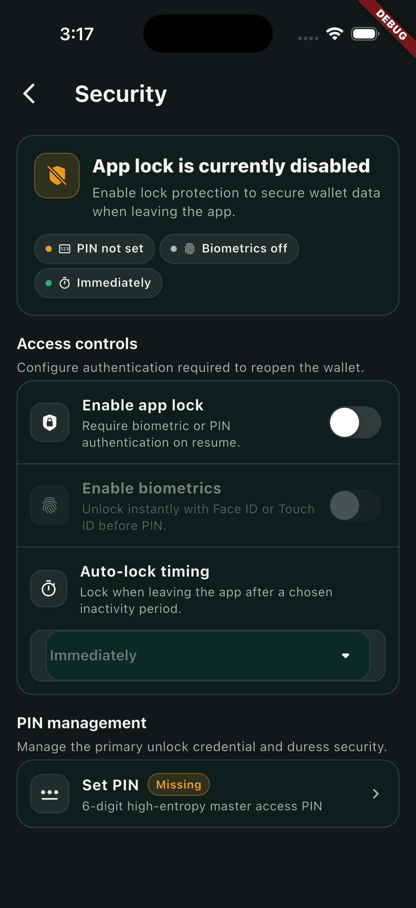
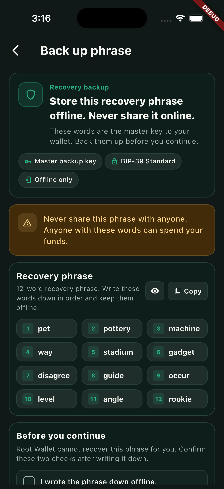
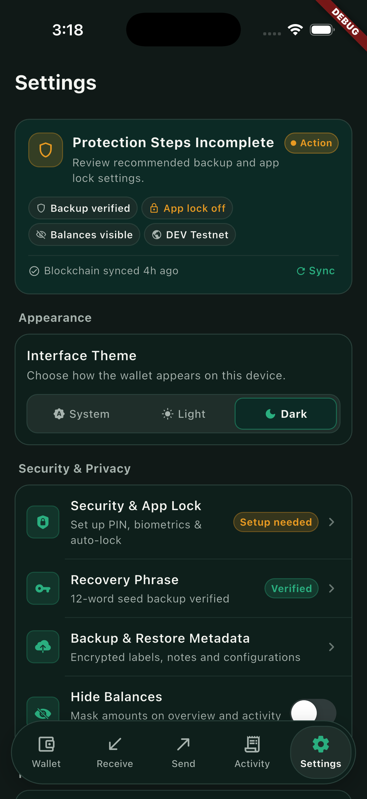

# Root Wallet

**Own Bitcoin from the root.**

Root Wallet is an open-source, self-custody Bitcoin wallet built with Flutter and Bitcoin Dev Kit.

> [!WARNING]
> **ROOT WALLET IS CURRENTLY TESTNET SOFTWARE.**  
> It is not currently recommended for storing real Bitcoin. Mainnet is disabled by a compile-time constant and enforced by runtime network guards. Root Wallet is under active development and security review on the Bitcoin Testnet.

---

## 1. Product Overview

Root Wallet is built from first principles for sovereign Bitcoiners who value self-custody, cryptographic transparency, and noise-free software.

- **Bitcoin-Only:** Exclusively focused on Bitcoin. No altcoins, no tokens, no cross-chain bridges, and no speculative noise.
- **Self-Custodial:** Your keys, your Bitcoin. Private keys and recovery phrases are generated locally and designed to remain on your device. Network communication is focused on blockchain synchronization and transaction broadcasting.
- **Powered by BDK:** Built on the Rust [Bitcoin Dev Kit](https://github.com/bitcoindevkit/bdk) via [`bdk_dart`](https://github.com/bitcoindevkit/bdk-dart).
- **Privacy-Conscious:** Zero third-party telemetry, zero trackers, zero account registration, and local-only storage without cloud dependencies.
- **Beginner-Friendly on the Surface, Advanced Underneath:** Streamlined for everyday payments while exposing power tools (Taproot, coin control, RBF, custom backends) when you need them.
- **Intentional Design:** Strictly uses flat, solid brand colors. Zero distracting gradients, glowing borders, or glassmorphism.

---

## 2. Screenshots

| Home | Receive | Send |
| :---: | :---: | :---: |
|  |  |  |

| Security & Lock | Backup Phrase | Settings |
| :---: | :---: | :---: |
|  |  |  |

*Explore more screenshots and light mode visuals in the [`docs/screenshots/`](docs/screenshots/) directory.*

---

## 3. Why Root Wallet?

Most consumer wallets today have become financial supermarkets—cluttered with altcoins, custodial exchange integrations, intrusive KYC prompts, and privacy-leaking analytics SDKs.

Root Wallet returns to the original promise of Bitcoin:
- **Zero Accounts:** No email, phone number, or identity verification required.
- **Noise-Free Interface:** Designed like an editorial instrument rather than a casino game.
- **Cryptographic Independence:** Verifiable public source code that anyone can review, compile, and run independently.

---

## 4. Features

### Everyday Payments (Simple Mode)
- **Instant Wallet Creation & Restore:** Generate 12-word BIP-39 recovery phrases or restore existing wallets.
- **Receive:** Clean QR codes, BIP-21 URI formatting, and native sharing.
- **Send:** Scan camera QR codes or paste addresses, customize network fees, and review transaction details prior to broadcast.
- **Transaction History:** Confirmation tracking during wallet synchronization, transaction detail inspector, and block explorer shortcuts.

### Advanced Bitcoin Capabilities
- **Script Type Flexibility:** Native SegWit (P2WPKH, `tb1q...`) and Taproot (P2TR, `tb1p...`) support.
- **Granular Coin Control:** Inspect individual UTXOs, freeze/lock specific coins, and break address reuse.
- **Replace-By-Fee (RBF):** Signal RBF on outgoing transactions to bump transaction priority.
- **Custom Node Overrides:** Support for configuring custom backend endpoints.

---

## 5. Security Architecture

Root Wallet's defense-in-depth architecture applies multiple layers of protection against common physical and digital attack vectors:

- **Argon2id Memory-Hard PIN KDF:** Application unlock PINs are verified using Argon2id (`m=16MB, t=3, p=1`) with persistent brute-force lockout ladders.
- **Authenticated Backup V2 (AES-256-GCM):** Encrypted metadata backups use pure-Dart AES-256-GCM with HKDF-SHA256 key derivation to provide integrity verification and mitigate padding oracle attacks.
- **Ephemeral Mnemonic Lifecycle:** Root Wallet minimizes the amount of time recovery phrases are retained in application state and removes references after sensitive flows complete.
- **Multitasking Screen Protection:** iOS app-switcher and Android screen-capture protections reduce exposure in screenshots and app-switcher previews.
- **Auto-Clearing Clipboard:** Sensitive clipboard copies (such as seed phrases) are automatically sanitized after 60 seconds.

For complete technical specifications, see [`docs/security_model.md`](docs/security_model.md) and our internal [`SECURITY_AUDIT.md`](SECURITY_AUDIT.md).

---

## 6. Architecture & Clean Code

The codebase is strictly structured around feature-first clean architecture and Riverpod:

```
lib/
├── app/          # App shell, routing, Riverpod DI, theme, security gate
├── core/         # Hardware wrappers, network environment, crypto services
├── features/     # Isolated modules: wallet, send, receive, settings, onboarding
└── shared/       # Cross-cutting reusable UI widgets and utilities
```

- **Separation of Concerns:** Zero direct BDK or network calls inside Flutter widgets.
- **Design Tokens:** Strict enforcement of solid brand tokens in [`RootBrandColors`](lib/app/theme/brand/root_brand_colors.dart).
- Read the full architecture document: [`docs/architecture.md`](docs/architecture.md).

---

## 7. BDK Integration

Root Wallet uses [`bdk_dart`](https://github.com/bitcoindevkit/bdk-dart) pinned to `v1.0.0-rc.2`:

```yaml
bdk_dart:
  git:
    url: https://github.com/bitcoindevkit/bdk-dart.git
    ref: v1.0.0-rc.2
```

Upstream dependencies are locked via [`tool/ci/bdk_dart_Cargo.lock`](tool/ci/bdk_dart_Cargo.lock) to ensure reproducible compilation against stable Rust toolchains (`rustc 1.85.1`).

Read the complete dependency analysis: [`docs/bdk_dependency_chain.md`](docs/bdk_dependency_chain.md).

---

## 8. Testnet Status & Safety Locks

To protect users while security reviews and hardening proceed:
- `AppConstants.isMainnetAllowed = false` is compiled into the app.
- Mainnet selection is disabled in the current build configuration and rejected by runtime network checks.
- Default backends point to public Bitcoin Testnet infrastructure:
  - Esplora: `https://blockstream.info/testnet/api`
  - Electrum: `ssl://electrum.blockstream.info:60002`
  - Explorer: `https://mempool.space/testnet`

---

## 9. Development & Local Setup

### Prerequisites
- **Flutter SDK:** Version `3.41.4` (managed via [`.fvmrc`](.fvmrc)) with Dart `^3.10.7`.
- **Rust Toolchain:** Stable `rustc` and `cargo` (recommended `1.85.1+`).

### Quick Start
```bash
# 1. Clone repository
git clone https://github.com/j-kon/root_wallet.git
cd root_wallet/root_wallet

# 2. Install dependencies
flutter pub get

# 3. Verify static analysis
flutter analyze

# 4. Run automated test suites
flutter test test/security/
flutter test --exclude-tags golden

# 5. Launch in simulator/device
flutter run
```

---

## 10. Contributing

We welcome contributions from Bitcoin developers, security researchers, designers, and testers!

Please read [`CONTRIBUTING.md`](CONTRIBUTING.md) for our contribution workflow, branch conventions, and testing requirements. All participants must abide by our [`CODE_OF_CONDUCT.md`](CODE_OF_CONDUCT.md).

---

## 11. Security Disclosures

If you discover a security vulnerability or cryptographic flaw in Root Wallet, **DO NOT file a public issue**.

Please report vulnerabilities confidentially in accordance with our [Security Policy](SECURITY.md) using GitHub Private Vulnerability Reporting or via verified maintainer contacts.

---

## 12. Roadmap

Root Wallet is being developed in six sequential phases:
- **Phase 1: Testnet Wallet Foundation** *(Completed)*
- **Phase 2: Security Hardening & Threat Model Remediation** *(Completed / Ongoing Review)*
- **Phase 3: Open-Source Public Foundation** *(Current)*
- **Phase 4: Privacy & Network Tooling (Tor / Custom Nodes)**
- **Phase 5: Mainnet Release Candidate & Third-Party Audit**
- **Phase 6: Advanced Bitcoin Tooling (Hardware Wallets / PSBT)**

See the full roadmap: [`ROADMAP.md`](ROADMAP.md).

---

## 13. License

Root Wallet is dual-licensed under either:

- [MIT License](LICENSE-MIT)
- [Apache License 2.0](LICENSE-APACHE)

at your option.

See:
- [`LICENSE-MIT`](LICENSE-MIT)
- [`LICENSE-APACHE`](LICENSE-APACHE)
- Root notice: [`LICENSE`](LICENSE)

SPDX-License-Identifier: `MIT OR Apache-2.0`

---

## 14. Disclaimer

Root Wallet is experimental software provided under development for testing and educational purposes on the Bitcoin Testnet. Use at your own risk. The developers assume no liability for lost funds, lost recovery phrases, or software malfunctions. Never commit real funds or enter real mainnet private keys into testnet software.
